# Autonomous Glider Flight Control System

An autonomous flight control system for an unpowered glider that navigates a narrowing corridor using ultrasonic sensors and servo-controlled surfaces. The system uses rate-based control to maintain stable flight through real-time sensor feedback.


## Mission Overview

### Project Goal
Design and implement an autonomous flight control system that successfully navigates an unpowered glider through a narrowing corridor using only sensor feedback and control surfaces. The glider must maintain stable flight while avoiding collision with walls and ground.

### Mission Requirements
- **Flight Duration:** 2-5 seconds
- **Initial Corridor Width:** 8 feet
- **Final Corridor Width:** 3 feet  
- **Corridor Length:** 15 feet
- **Target Altitude:** 3.5 feet above ground
- **Navigation:** Fully autonomous (no human intervention after launch)

### Mission Map


Challenges:
• Maintain altitude (avoid ground collision)
• Navigate narrowing corridor (avoid wall collision)
• React to rate of change (predictive control)
• Complete mission in 2-5 seconds
```

### Success Criteria
✅ Glider maintains stable flight throughout corridor  
✅ No collision with walls or ground  
✅ Sensor data logged continuously  
✅ Autonomous control demonstrated  
✅ Flight completed within expected timeframe  

## Hardware Components

### Microcontroller
- **Seeeduino Xiao (SAMD21)** - ARM Cortex-M0+ based board with compact form factor

### Sensors
- **2x HC-SR04 Ultrasonic Range Finders**
  - Right wall distance sensor (measures lateral position)
  - Height sensor (measures altitude above ground)
  - Range: 2cm - 400cm
  - Measurement frequency: ~20Hz

### Actuators
- **2x Micro Servos**
  - Rudder servo (lateral control)
  - Elevator servo (pitch/altitude control)
  - PWM control: 900-2100µs

### Power
- Battery + Boost Converter(s)

## Pin Configuration

| Component | Pin | Description |
|-----------|-----|-------------|
| Elevator Servo | D1 | Pitch control servo signal |
| Rudder Servo | D2 | Yaw control servo signal |
| Height Echo | D3 | Height sensor echo pin |
| Height Trigger | D4 | Height sensor trigger pin |
| Right Echo | D5 | Right distance sensor echo pin |
| Right Trigger | D6 | Right distance sensor trigger pin |
## Installation & Setup

### Prerequisites
- [PlatformIO](https://platformio.org/) installed in VS Code
- USB cable for Seeeduino Xiao
- Soldering equipment or breadboard for sensor/servo connections

### Hardware Assembly
1. **Connect Ultrasonic Sensors:**
   - Right sensor: VCC→5V, GND→GND, TRIG→D6, ECHO→D5
   - Height sensor: VCC→5V, GND→GND, TRIG→D4, ECHO→D3

2. **Connect Servos:**
   - Rudder: Signal→D2, VCC→5V, GND→GND
   - Elevator: Signal→D1, VCC→5V, GND→GND

3. **Power Supply:**
   - Connect battery through boost converter to provide stable 5V
   - Ensure sufficient current capacity for servos

### Software Installation
```bash
# Clone repository
git clone https://github.com/VahidDanesh/fixed-wing.git
cd fixed-wing

# Build project
pio run

# Upload to board
pio run --target upload

# Monitor serial output
pio device monitor -b 115200
```

## Testing Procedures

### 1. Sensor Test
Upon startup, the system performs automatic sensor testing:
```
Testing sensors...
Test 1 - Right: XX.X cm, Height: XX.X cm
Test 2 - Right: XX.X cm, Height: XX.X cm
...
Sensor Init OK - Right: XX.X cm, Height: XX.X cm
System Ready. Waiting for launch...
```

**Expected behavior:**
- Both sensors should return valid readings (not -1.0)
- Values should be stable and consistent
- Right sensor: measure distance to nearest wall
- Height sensor: measure distance to ground

**Troubleshooting:**
- If readings show -1.0: Check wiring connections
- If values are erratic: Ensure sensors are mounted securely
- If no output: Verify serial monitor baud rate (115200)

### 2. Servo Calibration Test
The servos initialize to neutral positions on startup:
- Rudder: 1700µs (neutral)
- Elevator: 1100µs (neutral)

**Manual calibration (if needed):**
Adjust these constants in `main.cpp`:
```cpp
const int SERVO_RUDDER_NEUTRAL = 1700;
const int SERVO_RUDDER_LEFT = 900;
const int SERVO_ELEVATOR_NEUTRAL = 1100;
const int SERVO_ELEVATOR_UP = 2100;
```

### 3. Flight Test Checklist
- [ ] Sensors return stable readings on ground
- [ ] Servos centered at neutral positions
- [ ] Battery fully charged
- [ ] Glider balanced and trimmed
- [ ] Launch detection threshold set (60cm default)
- [ ] Clear flight path available

## Control Algorithm

### Overview
The system uses a **rate-based bang-bang controller** with servo hold timers to maintain stable flight. Control decisions are based on the rate of change of sensor readings rather than absolute positions.

### Algorithm Flow

```
┌─────────────────────────────────────────┐
│ 1. READ SENSORS (20Hz)                  │
│    - Ultrasonic right wall distance     │
│    - Ultrasonic height                  │
│    - Apply low-pass filter (α=0.7)      │
│    - Reject spikes (>60cm jumps)        │
└──────────────┬──────────────────────────┘
               │
┌──────────────▼──────────────────────────┐
│ 2. LAUNCH DETECTION                     │
│    - Monitor height sensor              │
│    - Trigger when height > 60cm         │
│    - Initialize rate calculation        │
└──────────────┬──────────────────────────┘
               │
┌──────────────▼──────────────────────────┐
│ 3. CALCULATE RATES OF CHANGE            │
│    - rawRate = -(current - prev) / dt   │
│    - Apply 3-sample rolling average     │
│    - Clamp extreme values (>200 cm/s)   │
└──────────────┬──────────────────────────┘
               │
┌──────────────▼──────────────────────────┐
│ 4. CONTROL LOGIC                        │
│                                         │
│  RUDDER:                                │
│   IF avgRateRight > 50 cm/s             │
│     → Servo LEFT (900µs)                │
│     → Hold for 500ms                    │
│   ELSE                                  │
│     → Servo NEUTRAL (1700µs)            │
│                                         │
│  ELEVATOR:                              │
│   IF avgRateHeight > 50 cm/s            │
│     → Servo UP (2100µs)                 │
│     → Hold for 500ms                    │
│   ELSE                                  │
│     → Servo NEUTRAL (1100µs)            │
└──────────────┬──────────────────────────┘
               │
┌──────────────▼──────────────────────────┐
│ 5. SERVO OUTPUT                         │
│    - Apply smoothing (α=0.7)            │
│    - Deadband filter (300µs minimum)    │
│    - Write to servos                    │
└─────────────────────────────────────────┘
```



```mermaid
flowchart TD
    Start([System Startup]) --> Init[Initialize Hardware<br/>Configure pins<br/>Attach servos<br/>Test sensors 5x]
    Init --> Neutral[Set Servos to Neutral]
    Neutral --> WaitLaunch{Launch Detected?<br/>Height > 60cm}
    
    WaitLaunch -->|No| ReadSensors1[Read Sensors<br/>20Hz Loop]
    ReadSensors1 --> WaitLaunch
    
    WaitLaunch -->|Yes| StartFlight[Start Flight Timer<br/>Initialize Previous Values]
    
    StartFlight --> ControlLoop[Control Loop 20Hz]
    
    ControlLoop --> ReadSensors2[Read Sensors<br/>Right wall distance<br/>Height above ground]
    ReadSensors2 --> Filter[Apply Low-Pass Filter<br/>Reject spikes > 60cm]
    
    Filter --> CalcRate[Calculate Rate of Change<br/>rawRate = -Δdistance / Δtime]
    CalcRate --> RollingAvg[Apply Rolling Average<br/>3-sample window]
    
    RollingAvg --> RudderCheck{avgRateRight<br/>> 50 cm/s?}
    RudderCheck -->|Yes| RudderLeft[Rudder LEFT <br/>Start Hold Timer]
    RudderCheck -->|No| RudderHoldCheck{Hold Timer<br/>Active?}
    RudderHoldCheck -->|Yes, < 500ms| RudderLeft
    RudderHoldCheck -->|No| RudderNeutral[Rudder NEUTRAL]
    
    RudderLeft --> ElevatorCheck{avgRateHeight<br/>> 50 cm/s?}
    RudderNeutral --> ElevatorCheck
    
    ElevatorCheck -->|Yes| ElevatorUp[Elevator UP <br/>Start Hold Timer]
    ElevatorCheck -->|No| ElevatorHoldCheck{Hold Timer<br/>Active?}
    ElevatorHoldCheck -->|Yes, < 500ms| ElevatorUp
    ElevatorHoldCheck -->|No| ElevatorNeutral[Elevator NEUTRAL 1100µs]
    
    ElevatorUp --> Smooth[Apply Servo Smoothing]
    ElevatorNeutral --> Smooth
    
    Smooth --> Deadband{Change ><br/>300µs?}
    Deadband -->|Yes| WriteServo[Write to Servos]
    Deadband -->|No| Skip[Skip Write<br/>Thermal Protection]
    
    WriteServo --> Delay[Wait for Next Cycle<br/>50ms period]
    Skip --> Delay
    
    Delay --> ControlLoop
    
    style Start fill:#132a13
    style WaitLaunch fill:#780000
    style RudderCheck fill:#005f73
    style ElevatorCheck fill:#005f73
    style WriteServo fill:#31572c
    style ControlLoop fill:#31572c
    style Deadband fill:#f48c06
```

### Key Features

**1. Low-Pass Filtering**
- Exponential moving average smooths sensor noise
- α = 0.7 balances responsiveness vs. stability
- Spike rejection prevents erroneous readings (>60cm jumps ignored)

**2. Rate-Based Control**
- Monitors *rate of change* instead of absolute position
- Positive rate = approaching wall/ground → corrective action needed
- Negative rate = moving away → maintain course

**3. Rolling Average**
- 3-sample window smooths rate calculations
- Reduces control jitter from measurement noise
- Provides more stable control decisions

**4. Servo Hold Timer**
- Maintains correction for 500ms after trigger
- Allows glider time to respond to control inputs
- Prevents rapid oscillation between neutral and max

**5. Thermal Protection**
- Deadband (300µs) prevents micro-adjustments
- Smoothing (α=0.7) reduces servo movement frequency
- Designed for 2-5 second flight duration

### Tunable Parameters

| Parameter | Default | Description |
|-----------|---------|-------------|
| `PARAM_RATE_RIGHT_THRESHOLD` | 50.0 cm/s | Trigger rudder correction |
| `PARAM_RATE_HEIGHT_THRESHOLD` | 50.0 cm/s | Trigger elevator correction |
| `SERVO_HOLD_TIME_MS` | 500 ms | Hold servo position after trigger |
| `DIST_FILTER_ALPHA` | 0.7 | Low-pass filter strength |
| `SERVO_SMOOTHING_ALPHA` | 0.7 | Output smoothing factor |
| `SERVO_DEADBAND_US` | 300 µs | Minimum servo movement |
| `LAUNCH_HEIGHT_CM` | 60.0 cm | Launch detection threshold |

### Flight Phases

**Phase 1: Ground Idle**
- Sensors active, reading environment
- Servos at neutral position
- Waiting for launch detection (height > 60cm)

**Phase 2: Flight Active**
- Rate calculations begin
- Control law active
- Continuous sensor monitoring at 20Hz
- Servo adjustments based on rate thresholds

**Phase 3: Landing**
- System continues operation until power loss
- Data logging continues throughout flight

## Performance Characteristics

- **Control Loop:** 20Hz (50ms period)
- **Sensor Update:** 20Hz with filtering
- **Response Time:** ~50ms (one loop cycle)
- **Servo Hold:** 500ms per activation
- **Expected Flight Duration:** 2-5 seconds

## Troubleshooting

### Sensors Not Reading
- Check wiring connections (especially echo/trigger pins)
- Verify 5V power supply is stable
- Ensure sensors are not blocked or damaged
- Serial output will show -1.0 for timeout errors

### Servos Not Moving
- Verify servo power supply (separate from microcontroller if needed)
- Check signal wire connections
- Confirm neutral positions are calibrated correctly
- Monitor for deadband filter (requires >300µs change)

### Erratic Flight Behavior
- Reduce rate thresholds (try 30-40 cm/s)
- Increase hold time (try 700-1000ms)
- Verify sensor mounting is rigid (no vibration)
- Check control surface deflections are correct direction

### Launch Not Detected
- Lower `LAUNCH_HEIGHT_CM` threshold (try 40-50cm)
- Verify height sensor is pointing downward
- Check sensor is not reading ground during hand launch

## Data Logging

The system outputs telemetry via serial at 5Hz (disabled by default to reduce overhead):
```
T:0.20 | DistR:150.5 | DistH:95.3 | RateR:12.5 | RateH:-5.2 | Rud:1700 | Ele:1100
```

**Enable logging:** Uncomment section 11 in `loop()` function


## Mission Objectives

This system is designed for autonomous glider navigation through a narrowing corridor:
- Maintain stable altitude (~105cm target)
- Navigate corridor narrowing from 152cm to 23cm
- React to rate of change to prevent wall/ground collision
- Complete flight in 2-5 seconds
- Log sensor data proving autonomous operation